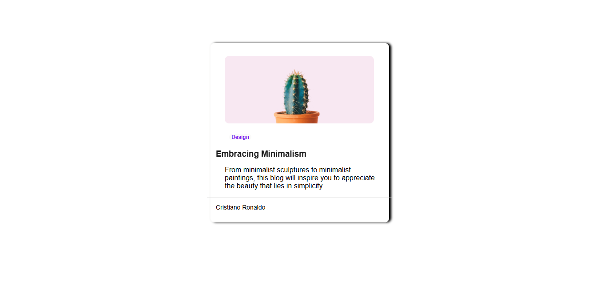

<!-- Please update value in the {}  -->

<h1 align="center">{Your project name} | devChallenges</h1>

   Solution for a challenge <a href="https://devchallenges.io/challenge/minimal-blog-card" target="_blank">Minimal Blog Card</a> from <a href="http://devchallenges.io" target="_blank">devChallenges.io</a>.

  <h3>
    <a href="{https://minimal-blog-card-chi.vercel.app/}">
      Demo
    </a>
    </h3>
    <h3>
     | 
    <a href="https://devchallenges.io/challenge/minimal-blog-card">
      Challenge
    </a>
  </h3>

<!-- TABLE OF CONTENTS -->

## Table of Contents

- [Overview](#overview)
- [What I learned](#what-i-learned)
- [Built with](#built-with)
- [Features](#features)
- [Contact](#contact)

<!-- OVERVIEW -->

## Overview

### What I learned

I learned how to structure a webpage using semantic HTML tags like `<figure>`, `<figcaption>`, and `<footer>`.
I practiced styling with CSS properties such as `border-radius`, `box-shadow`, and `opacity` to improve visuals.
I learned to center elements using Flexbox with `justify-content` and `align-items`.
I explored spacing control with `margin` and `padding`.

### Built with

- Semantic HTML5 markup
- CSS custom properties
- Flexbox

## Features

This application/site was created as a submission to a [DevChallenges](https://devchallenges.io/challenges-dashboard) challenge.

## Contact

- GitHub [@nati-sebhat](https://github.com/nati-sebhat)
